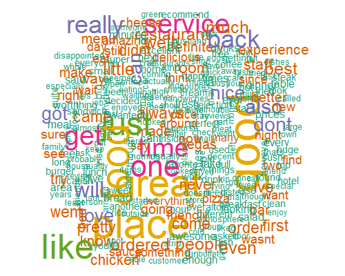
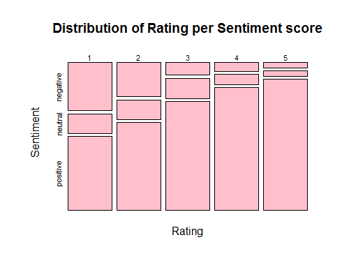

Yelp Text Analysis: Predicting review ratings based on review Text
========================================================
author: Stephane Nyombayire
date: Wed, 19th Nov 2015

Introduction
========================================================
This project aims at analyzing [Yelp review data set](http://www.yelp.com/dataset_challenge) to answer the following: 

- Could we predict the Yelp star rating using verbatim review text? 

The rationale behind this study is both an academic exercise on natural language techniques for deriving insights from text, but more importantly this could help Yelp determine the importance of the verbiage provided by the users' review text to assess whether there is an incremental benefit of having the text for rating a business.

========================================================
left: 60%
<small>
- Dataset has ~1.5 Million rows with 10 variables
- We are primarily interested in "text"" and "stars" variable
- We apply the following transformation to the text columns:
  - Obtain a document term matrix by removing numbers, punctuation, strip extra white spaces and stop words
  - Run a sentiment analysis on the document matrix to score each word in our document
  - Extract key topics using Latent Dirichlet Allocation and pick the highest gamma score
</small>

***  
 

***
 

Modeling
========================================================
<small>
We considered two models for this classification problem. SVM (support vector machines) and Decision Tree classifier using RPart. We first split the train data set and validation (75% and 25% respectively) 

1. SVM
  - The model performance is rather poor with accuracy of 38%.
  - confusionMatrix(svm.pred, testing[,1])["overall"]
    - ##       Accuracy = 0.39516129            
    - ##     Kappa =     0.03908248
2. RPart
  - Decision tree model performs alot better acheiving 97% accuracy with very good recall and specificity as well. Kappa is also pretty high.
  - confusionMatrix(rpart.pred, testing[,1])["overall"]
    - ##       Accuracy = 9.677419e-01 
    - ##      Kappa = 9.563803e-01   
</small>    
Discussion
========================================================
Going back to the original question: 

- "Are we able to predict rating solely base on the review text?". 

The answer based on our analysis is yes. However, digging deeper our model perfoms rather well when only considering avgRating. Using the same RPart algorithm without average rating we notice a significant drop in accuracy to 39% accuracy. This shows that users dont really change their average behavior when it comes to rating!
